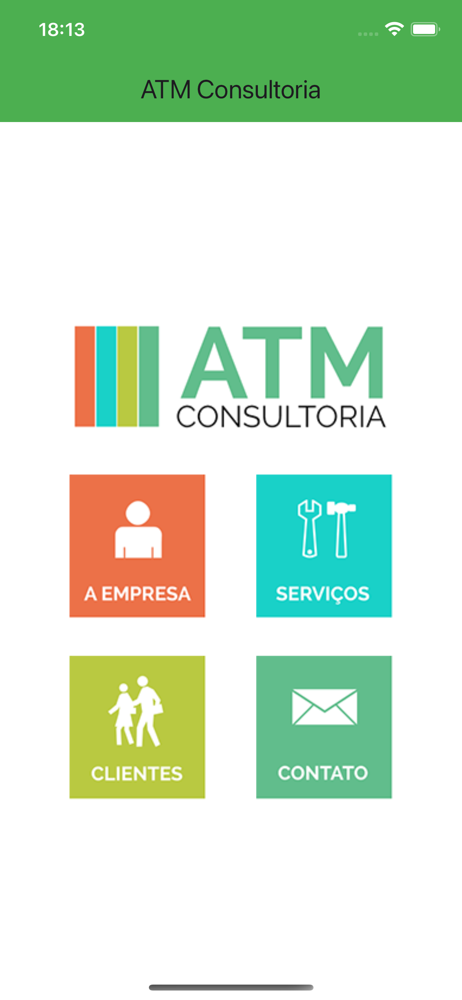
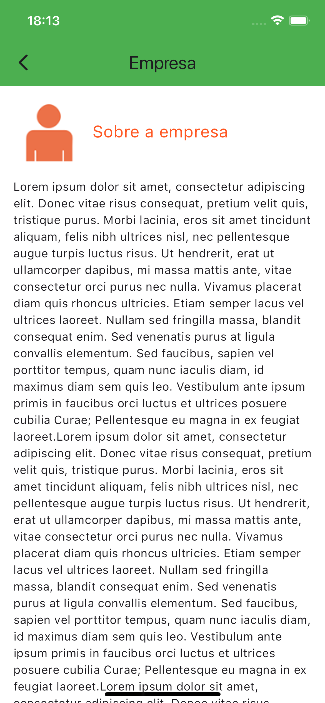
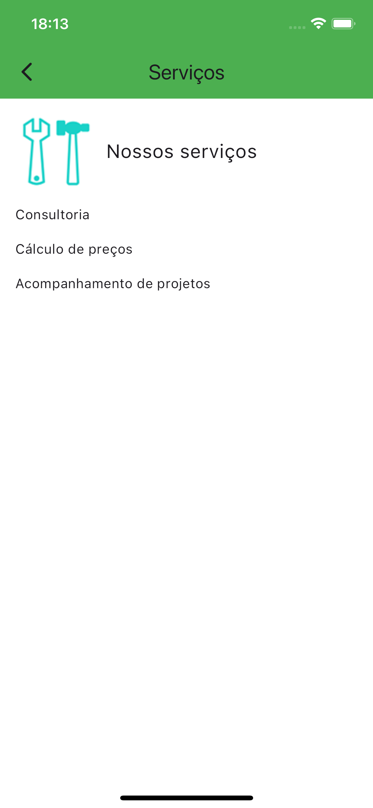
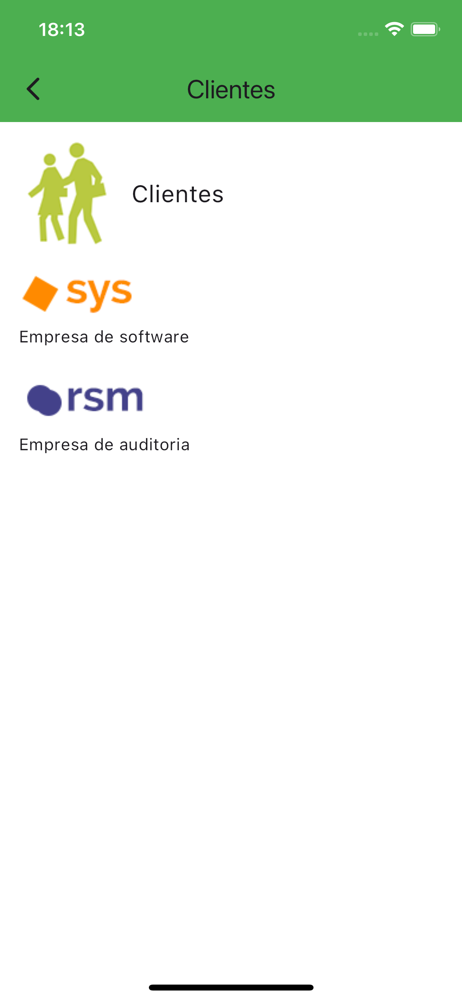
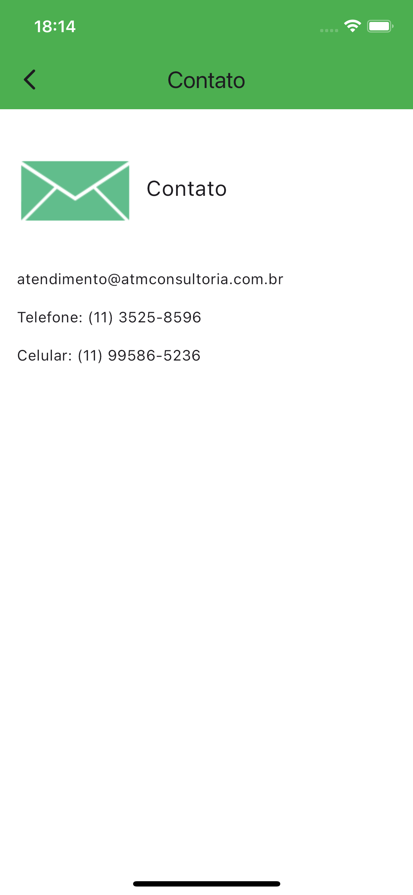

# App ATM Consultoria

## Descrição

Um aplicativo simples desenvolvido durante o curso de Desenvolvimento Flutter Mobile.

## Curso

**Desenvolvimento Android e IOS com Flutter - Crie 15 Apps**

[Link para o curso na Udemy](https://www.udemy.com/course/desenvolvimento-android-e-ios-com-flutter/?couponCode=MCLARENT71824)

## Status do Projeto

- **Concluído:** 12/10/2021
- **Atualizado:** 30/07/2024

## Tecnologias Utilizadas


## Funcionalidades

- Tela inicial
- Sobre a empresa
- Tela de serviços
- Tela de clientes
- Tela de contatos

## Instalação

Siga os passos abaixo para rodar o projeto localmente:

1. Clone o repositório:
    ```sh
    git clone https://github.com/rafaelleonan/app-flutter-atm-consultoria.git
    ```
2. Navegue até o diretório do projeto:
    ```sh
    cd app-flutter-atm-consultoria
    ```
3. Instale as dependências:
    ```sh
    flutter pub get
    ```
4. Execute o aplicativo:
    ```sh
    flutter run
    ```

## Telas
<p>
  
  
  
  
  
</p>

## Video Demonstração
[Assista o vídeo](https://uc00f6a4faca10ca44e1027fd17d.dl.dropboxusercontent.com/cd/0/inline/CXwWocembkMrMFoqgkFvcB62gZnMmn3FfYkFCVkzc4YIQ5rw0iwLJyujSRGrn9e6CWGzTAuQaahR03w56atakQ4n0hISfNuL_9KcPKq4_alltHupNYzG4NTeQIdNH73Ncq-XFAuelJ77lhhpewiNNAx1/file#)
